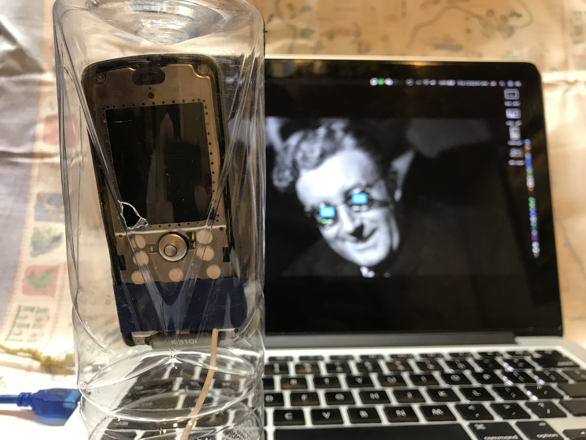

# You cool with my new phone?
#### Narrative & Dynamic system 20_Divination system

### [Video Demo link](https://vimeo.com/405502725)

### About Tal

Born in the mid 2000s, Tal is Billy's first phone, in the age of exponential growth in personal device, Tal has been repurposed as the "Oracle". Placed inside a highly secured chamber, when the owner buys a new phone, Tal helps sense the "Vibe" of their relationship, visioning how the owner's live will be with his/her/their new device.

### Work with Tal

#### __Step 1:__ Place your new phone beside Tal. (Preferably to its right.)

#### __Step 2:__ Put your right hand on top of your new phone.

#### __Step 3:__ Put your left hand on top of Tal's chamber.

#### __Step 4:__ Wait for 1~2 seconds and see what Tal has to say. (Probably some corny movie quotes.)

